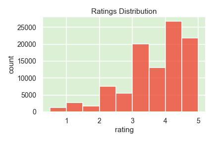
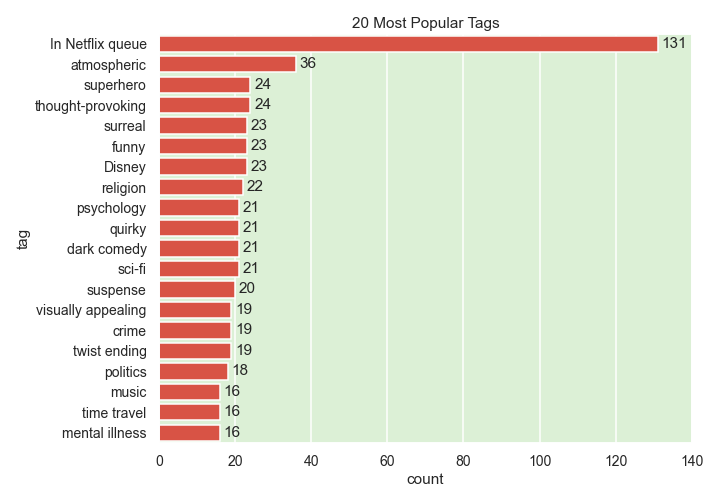

# Movie Recommendation System

## Overview

Since the advent of Netflix in 2008, the world of internet video streaming has evolved at a revolutionary pace. The global video streaming market size was estimated at USD 50.11 billion in 2020. With a compound annual growth rate of 21.0% from 2021 to 2028, it is expected to reach USD 223.98 billion by 2028. Telebi, a new video streaming service, plans to enter the fold in the next 2 years. The output of this project is a recommendation system that uses both content-based filtering and collaborative filtering and would work well as part of a larger hybrid recommendation system.

## Business Problem

Telebi is planning to enter the video streaming market and is developing recommendation system approaches prior to its launch. They are testing algorithms using MovieLens data made available by GroupLens. An effective reccomendation system should: 

- address the “cold start problem” of recommending films to new users (no prior ratings)
- predict user ratings and provide recommendations with collaborative filtering

## Data

This project used the "small" MovieLens dataset from the GroupLens research lab at the University of Minnesota. Source: https://grouplens.org/datasets/movielens/latest/

**`ratings`**
- 101K ratings (scale of 1-5) for 9,721 movies by 610 users

**`tags`**
- 1,589 tags for 1,572 movies by 58 users

**`movies`**
- titles/names and genre information for 9,739 films

## Scrubbing

#### Duplicates

Some film titles in the `movies` dataframe had two movie IDs (one name, two values for `movieId`). Consulting the MovieLens website showed that there were actually two distinct films named "Emma" that were released in 1996 and two distinct "War of the Worlds" films were released in 2005. The remaining three duplicated films were true duplicates. The entries with the most genre information were kept and `movieId` was updated accordingly in the `ratings` and `tags` data.

#### NLP preprocessing

Some preprocessing was required in order to create a content-based recommender using NLP. `movies` and `tags` data were merged in order to create a bag of words column containing all the tags and genre information for each film. All delimiters were removed from the text data and all words were converted to lower case. 

## EDA

#### Rating distribution

Ratings are on a scale of 0.5-5, in increments of 0.5. 3.5 is both the median and mean for this data. The distribution is skewed toward the higher end, which is what we would hope to see if users are being recommended films they will like.

#### Rating count distribution

The least number of films rated for a single user is 20, while the most ratings per user is 2898. High rating counts could be do to more engagement or age of the user's account. With median and third quartile values of 70 and 168 ratings per user, respectively, the overwhelming majority of users have rated under 200 films. The minimum number of ratings per user was 20, and this number was used to determine how many films a new user should rate before collaborative filtering can be applied in the demo (see results). 15 ratings was chosen as the "warm start" value. That is, a new user must explicitly rate 15 films generated from the content-based filtering step before the profile qualifies for collaborative filtering.

#### Rating behavior

Users who have rated a high number of movies have median ratings that are clustered around 3.5, the mean and median rating of the dataset. This is a basic demonstration of the Central Limit Theorem. The more films a user rates, the more representative their rating distribution will be to the rating distribution of the entire dataset.

#### Genre counts

Of the genre labels in the dataset, Drama and Comedy appear the most.

#### Most popular tags

The most popular tag is "In Netflix Que", which isn't very descriptive nor very helpful in terms of matching films based on text similarity. The other tags are much more informative.

## Content-Based Filtering

Content-based filtering recommends products based on the similarities of their content/attributes. This was used to solve the "cold start problem" of recommending films to a new user who has yet to submit any explicit ratings. TF-IDF vectorization was used to acquire vector representations of each bag of words. TF-IDF, or Term Frequency - Inverse Document Frequency, is a measure of how relevant a word is to a document in a collection of documents. Movies (the "documents") with similar TF-IDF vectors are similar by the defining characteristics of their bags of words. The pairwise `cosine_similarity` function was used on the word vectors to find the similarities between films. For a given film, this content-based filter returns the top-n most similar films based on their tags and genres.

### Evaluation

Content-based filtering was evaluated by how reasonable the recommendations the recommendations were.
For this dataset, better tags resulted in better matches. For example, "Toy Story" had tags like "pixar" and "fun" in addition to its genre labels. The most similar films to "Toy Story" in descending order include:

- 'Toy Story (1995)',
- "Bug's Life, A (1998)",
- 'Toy Story 2 (1999)',
- 'Guardians of the Galaxy 2 (2017)',
- 'Monsters, Inc. (2001)',
- 'Turbo (2013)',
- "Emperor's New Groove, The (2000)",
- 'The Good Dinosaur (2015)'

Note that "Toy Story" is most to itself, which is what we expect. Many of the other films are pixar and/or adventure/children/comedy/fantasy films, so these recommendations look sound.

Now let's examine the recommendations for movies like "American Psycho":

- 'Saw VI (2009)',
- "Bird with the Crystal Plumage, The (Uccello dalle piume di cristallo, L') (1970)",
- 'American Psycho (2000)',
- 'Book of Shadows: Blair Witch 2 (2000)',
- 'Testament of Dr. Mabuse, The (Das Testament des Dr. Mabuse) (1933)',
- 'From Hell (2001)',
- 'House of Wax (1953)',
- 'American Psycho II: All American Girl (2002)',

Many of the returned films have identical bags of words: "crime horror mystery thriller". Films with identical bags of words will have cosine similarities equal to 1 and it seems they are not returned in any meaningful order. In contrast, there was enough variety in the "Toy Story" recommendations to return them in a distinct order. If there are no user-submitted tags, the content-based filter has only genre information from which to calculate similarites. This is a problem that can be resolved with more descriptive text information for more films, including more tags or plot synopses.

## Collaborative filtering

Once a user has some explicit movie ratings in their profile, collaborative filtering can begin working. In general, collaborative filtering relies on past user behavior, analyzing relationships between users and products in order to predict unknown user-item associations. Neighborhood methods provide recommendations based on relationships between users or items. The user-based approach makes the assumption that like-minded users will like the same items.  Latent factor models, on the other hand, attempt to explain ratings by finding the hidden, or "latent" factors of both users and items. Matrix factorization helps to accomplish this, mapping a user-item matrix to a k-dimensional latent space where user-item interactions are modeled as the dot product of a user matrix (where the elements describe how much users prefer certain factors) and an item matrix (where the elements descibe how much of these factors each film possesses). 

### Evaluation

K-fold crossvalidation was performed on the data with 6 different baseline models. Of these, `SVD` and `BaselineOnly` performed the best (lowest RMSE). These prediction algorithms had comparable RMSE results on the test data, but `SVD` was much more overfit to the training data. Therefore, `BaselineOnly` was chosen as the prediction algorithm for this recommendation system. `BaelineOnly` is a matrix factorization method that finds the latent factors using ALS (alternating least squares). ALS computes the latent factors by alternating between fixing the user factors and the item factors as it works to minimize the cost function.

Best parameters (from GridSearch:

`bsl_options = {'method': 'als',
               'n_epochs': 50,
               'reg_u': 4,
               'reg_i': 3
               }`

Test RMSE: ~ 0.8647

The RMSE suggests that the predicted ratings can be 0.86 points off. 

## Demo (test recommendation system flow)

The purpose of the demo is to demonstrate how this recommendation system could function for a new user.

1. **User search**: New user searches the database for 3 films they have enjoyed in the past. The search is not case-sensitive.
2. **Content-based filtering**: System returns content-based recommendations for each search in order from most to least similar.
3. **User rates**: User rates 5 recommendations from each search
4. **Collaborative filtering**: Now that the user has submitted some explicit ratings, the system can predict their future ratings and return the top-n recommendations
5. **Process continutes**: As the user continues to rate films, they will receive more and better quality recommendations. Although this is not shown in the demo code, the user should have the option of more content-based filtering, more collaborative filtering, or perhaps some combination of both.

## Conclusions

The result of this project is a recommendation system that uses both content-based filtering and collaborative filtering. Content-based filtering is implemented to overcome the cold start problem, while collaborative filtering is used to predict a user's future ratings (which may be off by 0.86) and return the top n recommendations. Telebi should encourage its users to submit tags for movies they rate once their platform is up and running. As any streaming platform should, Telebi should also emphasize to users that their recommendations will get better as they continue to rate more films.

Future work should include gathering more descriptive text data to improve content-based recommendations. This could be in the form of additional tags or plot synopses. The content-based filter could be further improved with an actual front end. In the current demo, the user must explicitly search for films of interest by name to kickstart their recommendations. On a final website, perhaps users can select a film or groups of films by their cover art or other types of images.

## Sources

- https://marketrealist.com/2019/09/an-overview-of-the-streaming-services-industry/
- https://www.grandviewresearch.com/industry-analysis/video-streaming-market
